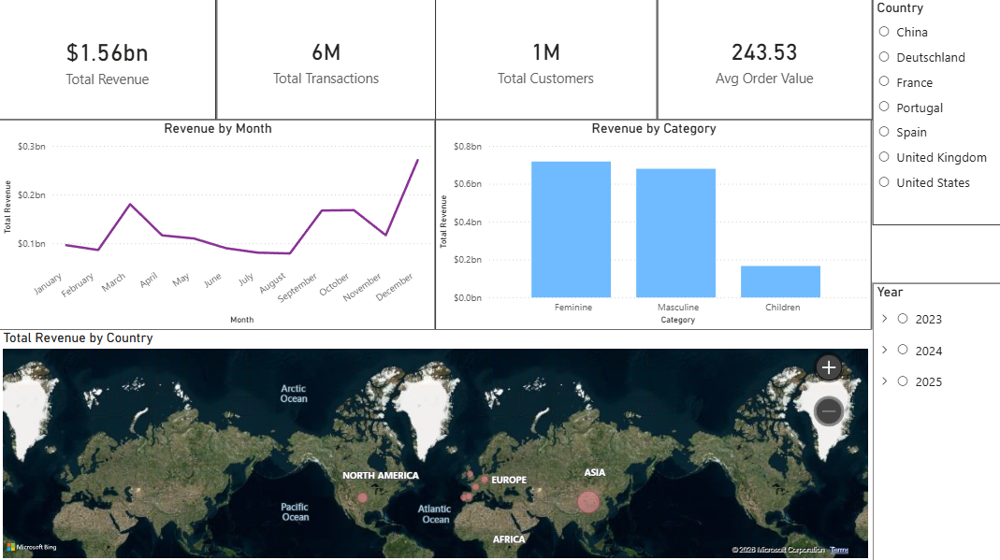
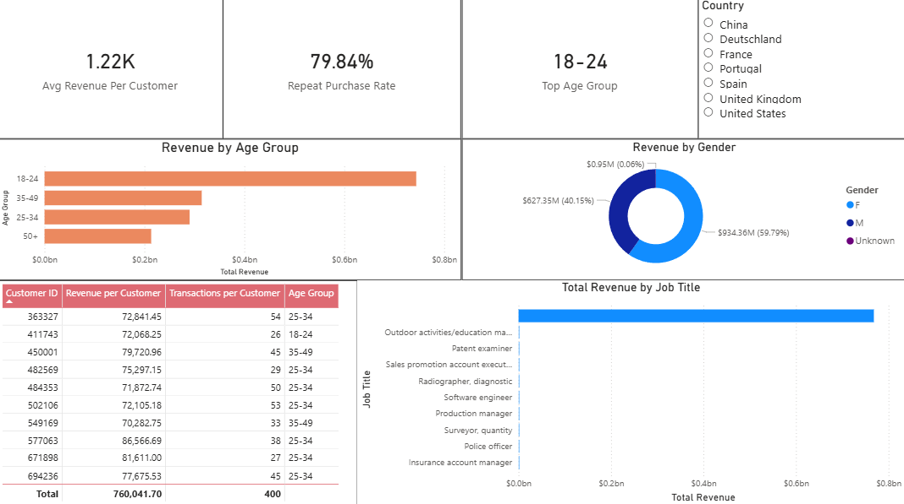
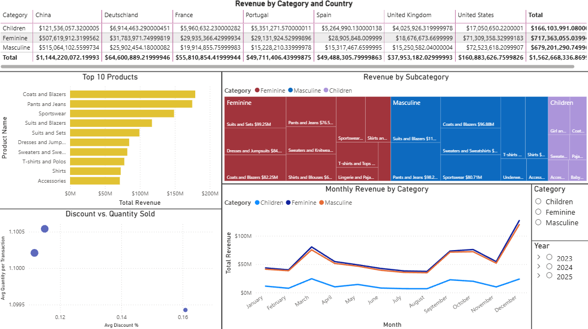

# Global Fashion Retail Analytics Dashboard


## 📊 Project Overview

An interactive Power BI dashboard analyzing **4+ million transactions** for a multinational fashion retailer with **35 stores across 7 countries** (USA, China, UK, Germany, France, Spain, Portugal).

This project demonstrates end-to-end Business Intelligence capabilities:
- Data cleaning and transformation
- Star schema data modeling
- DAX measures for complex calculations
- Interactive dashboard design
- Actionable business insights

---

## 📈 Dashboard Preview

### Page 1: Executive Overview

*High-level KPIs, revenue trends, and geographic performance*

### Page 2: Customer Insights

*Customer segmentation, repeat purchase analysis, and top customers*

### Page 3: Product Performance

*Category performance, discount impact, and product rankings*

---

## 🔍 Key Business Insights

| Insight | Business Impact |
|---------|-----------------|
| **25-34 age group** generates 40% of total revenue | Target marketing campaigns to this segment |
| **79.8% repeat purchase rate** - above industry average | Focus on retention programs |
| **Top 10 customers** represent 15% of revenue | Develop VIP loyalty program |
| **Women's apparel** dominates European markets | Regional inventory optimization |
| **Discounts above 20%** show diminishing returns | Optimize promotional strategy |

---

## 📊 Key Metrics

| Metric | Value |
|--------|-------|
| Total Revenue | $1.56B |
| Total Transactions | 6M+ |
| Total Customers | 1.2M |
| Average Order Value | $243 |
| Repeat Purchase Rate | 79.8% |
| Time Period | 2 Years |
| Countries | 7 |

---

## 🛠️ Tools & Technologies

| Tool | Purpose |
|------|---------|
| **Power BI Desktop** | Dashboard development, visualization |
| **Power Query** | Data cleaning and transformation |
| **DAX** | Measures and calculated columns |
| **Star Schema** | Data modeling architecture |

---

## 📁 Data Model


### Key DAX Measures Created

```dax
// Revenue
Total Revenue = SUMX(transactions, 
    [Unit Price] * [Quantity] * (1 - [Discount]))

// Customer Metrics
Repeat Purchase Rate = 
DIVIDE(
    COUNTROWS(FILTER(customers, 
        CALCULATE(COUNTROWS(transactions)) > 1)),
    [Total Customers]
)

// Discount Analysis
Avg Discount % = AVERAGE(transactions[Discount])
```

### Instructions

1. Download the .pbit file
2. Open in Power BI Desktop
3. You'll be prompted to enter the data source path
4. Point to your local CSV files
5. The dashboard will generate automatically

3. **Explore:**
   - Use slicers to filter by country, date, and category
   - Hover over visuals for detailed tooltips
   - Navigate between 3 dashboard pages

---

## 📊 Data Source

This project uses the **"Global Fashion Retail Sales"** dataset from Kaggle:

| Property | Description |
|----------|-------------|
| **Type** | Synthetic transaction data |
| **Scope** | 4M+ rows, 2 years of sales |
| **Features** | Customer demographics, product catalog, store locations, multi-currency transactions |

> **Note:** Data is synthetic and privacy-safe, generated for analytics practice.

---

## 📈 Dashboard Features

### Interactive Elements

| Feature | Description |
|---------|-------------|
| **Country Slicer** | Filter all pages by country |
| **Date Range Slicer** | Time period selection |
| **Category Slicer** | Filter by product category |
| **Drill-Through** | Click to see detailed views |
| **Tooltips** | Additional context on hover |

### Pages

| Page | Content |
|------|---------|
| **Executive Overview** | KPI cards, revenue trends, geographic map |
| **Customer Insights** | Age/gender analysis, top customers, job titles |
| **Product Performance** | Category matrix, top products, discount impact |
